# Benchmark Sistemático de Arquiteturas Visuais, World Models e Exploração em Procgen — Estudo com 5 Seeds, 5 Jogos e 100k Passos

**Python 3.10.11 + Procgen 0.10.7 + Stable-Baselines3 2.9.0 + PyTorch 2.5.1+cu121 (RTX 4070) — `C:\Users\Acer\AppData\Local\Programs\Python\Python310\python.exe`**

> **Resumo.** Avaliação sistemática de **16 arquiteturas** em **6 famílias** (`CNN` vs `Attention` vs `World Models` vs `Augment` vs `New Archs` vs `Exploração`) com **5 seeds** (`42-46`), **5 jogos** (`bossfight`, `starpilot`, `dodgeball`, `maze`, `heist` + `coinrun` controle) e **duas dificuldades** (`easy 200` / `hard 200` / `eval 0`) em `Procgen` (`~300 FPS` em `cuda`, `50k` em `~3 min`). Todos os experimentos usam `frame_stack=1` (`3×64×64` `CHW` `uint8`), `PPO` (`lr 3e-4`, `n_steps 256`, `batch 64`, `n_epochs 3`, `γ 0.99`, `λ 0.95`, `clip 0.2`), e `tensorboard` para a jornada. O eval começou com `10 episódios` e foi endurecido ao longo do estudo até o protocolo definitivo: **`100 eps` stoch + det em unseen levels (`seed+1000`)** — seções 3.10→3.12.

## 0. As 5 Conclusões do Estudo

1. **O protocolo de avaliação determina as conclusões — e `10` episódios não bastam.** Cada upgrade de protocolo (`10→30→100 eps`, unseen com `seed+1000`, dupla avaliação stoch+det) mudou rankings: o líder global caiu (`spatial 1.54 → 1.35`), o `ICM` perdeu a liderança de `maze`/`heist` que tinha a `30 eps` (ruído), e `vit` despencou em `dodgeball`. Lição permanente: em `Procgen`, ranking medido com `<100` episódios não é confiável (seções 3.10–3.12).
2. **Não existe vencedor absoluto — existe um líder consistente: `mlp_vector`.** No protocolo definitivo o top-5 global é estatisticamente indistinguível (`mlp_vector 1.43` ≈ `resnet18 1.34` ≈ `spatial 1.28` ≈ `lstm_attention 1.26` ≈ `aug_crop 1.25`), mas só o `mlp_vector` (MLP sobre `16×16` grayscale, `256D`) esteve no topo em **todos** os protocolos (`1.25@10 → 1.36@30 → 1.43@100`) e vence `starpilot`. Vencedores por jogo: `aug_crop` (`bossfight`), `mlp_vector` (`starpilot`), `resnet18` (`dodgeball`) (seção 3.12).
3. **World Models e exploração: conclusões contextuais, não universais.** WMs são fracos só no `bossfight` (`<0.5`); em `starpilot`/`dodgeball` empatam com CNNs — o "WM é fraco" original era efeito dominado por um jogo. Curiosidade (`ICM`/`RND`/`NGU`) empata com `PPO` em `maze`/`heist` a `100 eps` — a vantagem inicial era ruído de `30 eps` (seções 3.11–3.12).
4. **Neste budget, arquitetura importa menos que avaliação rigorosa — e mais budget não resolve.** O budget scaling (`100k→250k→500k`) mostra curvas **estagnadas** para as duas configs de topo nos seus jogos: `5×` budget não criou nem destruiu vantagem, e o gen gap seguiu `≈0` (sem memorização até `500k`). Com `5 seeds`, as diferenças entre configs são da ordem do ruído: o estudo reporta **tendências com IC**, não campeões (seções 3.8, 3.13).
5. **Em HRL, a alavanca é a abstração temporal — e skills aprendidas só ganham onde timing importa.** Em `jumper`, action-repeat (`skip4`) dá `4×` o flat e a hierarquia com skills fixas não adiciona nada; em `plunder`, só a hierarquia com **skills aprendidas** vence (`4.16` vs `3.53`, `+18%`) e produz política explorável deterministicamente (`det 2.70` vs `≤1.32`). "Hierarquia ajuda?" depende do jogo (seção 11.1).

---

## 1. Metodologia

### 1.1. Ambientes
- **Wrapper** `procgen_wrapper.py:6` `ProcgenGymWrapper(gymn.Env)` — converte `gym 0.26.2` `old API` (`obs, done`) → `gymnasium 1.3.0` (`obs, terminated, truncated`), `HWC 64×64×3 → CHW 3×64×64` (`np.transpose`), `Discrete(15)` (`bossfight`, `starpilot`, `dodgeball`, `coinrun`). Variante sem `CV` `procgen_wrapper.py:55` `ProcgenVectorWrapper` (`16×16` `grayscale` → `256D` `MLP`) para controle `mesmo jogo com/sem visão`.
- **Factory** `procgen_wrapper.py:85` `make_procgen_env(game, num_levels, distribution_mode, rand_seed, frame_stack, vector)` — `gym.make(f'procgen:procgen-{game}-v0', num_levels, distribution_mode, rand_seed)`.
- **Treino:** `num_levels=200` `distribution_mode='easy'` (padrão `Procgen`), **Eval:** `num_levels=0` (`ilimitado`, fases nunca vistas) `seed+1000` — mede generalização.
- **Sem Frame Stacking:** `frame_stack=1` `Box(3,64,64)` `uint8` em todos os benchmarks (`procgen_wrapper.py:21`). `frame_stack=4` (`12×64×64`) é suportado (`procgen_wrapper.py:19`) mas não usado; `Imitation-player` usa `128×128×4`.

### 1.2. Arquiteturas
- **CNN Clássica** `models/sb3_extractors.py:8` `ClassicCNNExtractor` — `Conv 32 8×8 s4 → 64 4×4 s2 → 64 3×3 s1 → Flatten → FC 512` (`600k` params), `HWC/CHW` auto-detectado (`is_hwc`).
- **Attention CNN** `models/sb3_extractors.py:63` `AttentionCNNExtractor(use_cbam)` — `CBAM` (`ChannelAttention` `reduction 16` + `SpatialAttention` `kernel 7`) `models/cnn_attention.py:82` ou só `SpatialAttentionModule` `models/cnn_attention.py:6` (`x * attention_map + x` com **residual** `models/cnn_attention.py:37` para estabilizar `spatial` puro que dava `0.00` determinístico). `FC 512`.
- **World Models** `models/world_model_extractors.py:6` — `VAEExtractor(latent 128, KL)` + `dream()` `deconv`, `AEExtractor` determinístico + `dream()`, `ReconExtractor` (`L2` `dec 3×64×64`) + `dream()`, `ContrastiveExtractor` (`InfoNCE` `noise 0.01` + `proj 64`).
- **Augment Contrastivo** `compare_augment_contrastive.py:14` `ContrastiveCrop` (`pad 4 + random 64`), `ContrastiveColor` (`brightness 0.8-1.2`), `ContrastiveNoise` (`noise 0.01`).
- **Novas Arquiteturas** `models/combined_extractors.py` — `ImpalaCNNExtractor` (stack de `ImpalaBlock` conv), `ImpoolaCNNExtractor` (`GAP 64D`), `LSTMAttentionExtractor` (`CNN + LSTM 256 + attention`), `ViTExtractor` (`64 patches 16×16 + Transformer 4 camadas`), `ResNet18Extractor` — todas com `FC 512` (`benchmark #6`).
- **Exploração (ICM/RND/NGU)** `compare_maze_heist.py:16` — `ICMWrapper` (bônus intrínseco por erro de modelo direto), `RNDWrapper` (destilação de rede aleatória), `NGUWrapper` (estende `RNDWrapper` com memória episódica, `reward += beta * bonus * episodic`) — aplicados sobre `maze`/`heist` (`benchmark #7`).

### 1.3. Seeds e Avaliação
- **Treino:** `5 seeds` (`42,43,44,45,46`) `PPO` `seed` + `procgen rand_seed` fixos — `mean±std` entre seeds em `statistics.json`.
- **Avaliação:** `10 episódios` `deterministic=False` (estocástico, corrige `spatial` que dava `0.00` determinístico vs `4.00` estocástico em `8k` teste) em `eval 0`.
- **Jornada:** `tensorboard --logdir logs_*` (`events.out.tfevents.*`).

### 1.4. Por que `100k` steps? Escopo do Regime Low-Data

A literatura padrão do `Procgen` (paper original, `IDAAC`/`PPG`) reporta `5M–25M` steps para performance próxima da humana — e os dados deste estudo confirmam: a `100k` os scores absolutos são baixos (`starpilot ~2.6`, `bossfight ~0.4`, `heist ~0.7`; só `coinrun` satura cedo, `8.0` a `50k`). **As duas afirmações não conflitam — respondem perguntas diferentes:**

| Regime | Pergunta | Budget típico |
|---|---|---:|
| **Resolver** o jogo | "atingir performance alta absoluta?" | `5M–25M` |
| **Comparar inductive bias** (este estudo) | "qual arquitetura extrai mais aprendizado por step, num budget fixo?" | `100k` |

`100k` aqui não é defeito — é a *definição do regime experimental* (low-data regime, como em estudos de augmentation/data-efficiency): diferenças de arquitetura aparecem cedo (ver eixo ⚡ `AUC` seção 3.9 e a virada do `ICM` na seção 3.10), e o custo é viável (`~10 min/modelo` na `RTX 4070 Laptop`; o grid de `115+` modelos seria impraticável em milhões de steps).

**Limitação honesta:** a ordenação a `100k` pode não persistir com mais budget (arquitetura lenta com teto alto perde aqui e ganharia a `25M`). Por isso as conclusões valem para *este* budget, e o item #6 da seção 6.1 (scaling `100k→250k→500k` nos vencedores) existe para testar a persistência das vantagens.

---

## 2. Benchmarks Executados

| # | Script | Jogo(s) | Timesteps | Seeds | Configs | Tempo | Log |
|---|---|---|---|---|---|---|---|
| 1 | `compare_procgen.py` | `coinrun` | `50k` | `5` | `classic/cbam/spatial/mlp_vector` | `~35 min` `5×50k` | `logs_procgen/comparison_coinrun_20260827_204023` |
| 2 | `compare_world_models.py` | `bossfight` | `100k` | `5` | `vae/ae/recon/contrastive` | `~67 min` `5×100k` | `logs_world_models/comparison_bossfight_20260827_193327` |
| 3 | `compare_suite.py` | `bossfight+starpilot+dodgeball` | `100k` | `5` | `4 WM +4 CNN +3 Augment =11` por jogo | `~8h` `16.5M steps` `20:41→04:47` | `logs_suite/suite_bossfight_starpilot_dodgeball_20260827_204109` |
| 4 | `compare_bossfight_hard.py` | `bossfight hard` | `100k` | `5` | `11` | `~2.5h` `07:21→09:57` | `logs_bossfight_hard/comparison_bossfight_hard_20260828_072148` |
| 5 | `compare_augment_contrastive.py` | `bossfight` | `100k` | `5` | `crop/color/noise` | `~80 min` (embutido no suite) | `logs_suite` `*_aug_*` |
| 6 | `compare_new_archs.py` | `bossfight+starpilot+dodgeball` | `100k` | `5` | `impala/impoola/lstm_attention/vit/resnet18` | `~12h` `13:45→01:39` `7.5M` | `logs_new_archs/new_archs_bossfight_starpilot_dodgeball_20260828_134545` |
| 7 | `compare_maze_heist.py` | `maze+heist` | `100k` | `5` | `ppo/icm/rnd/ngu` | `~6.5h` `01:48→08:23` `4M` | `logs_maze_heist/maze_heist_maze_heist_20260829_014802` |
| 8 | `compare_combined.py` | agregação `suite+new_archs` | — | — | ranking global `16 arquiteturas` | imediato (sem treino) | `results/global_16.png` |
| 9 | `re_eval_scorecard.py` | re-eval `new_archs+maze_heist` | — | — | `115 zips` × `30 eps` stoch+det + gap | `~70 min` (sem treino) | `results/re_eval_results.json` |
| 10 | `compare_suite_retrain.py` | `bossfight+starpilot+dodgeball` | `100k` | `5` | retreino da suite (`11 configs`, protocolo novo) | `~28h` `30/08→31/08` `16.5M` | `logs_suite_retrain/suite_retrain_zips` + `results/retrain_results.json` |
| 11 | `re_eval_100.py` | re-eval definitivo `275 zips` | — | — | `100 eps` stoch+det + gap (sem retreino) | `~5h` `31/08` | `results/eval100_results.json` |
| 12 | `compare_hrl.py` *(independente)* | `jumper+plunder` | `100k frames` | `5` | `flat` vs `skip4` vs `hrl` (seção 11) | `~6-12h` `31/08` | `logs_hrl/hrl_zips` + `results/hrl_results.json` |
| 13 | `compare_hrl_learned.py` *(independente)* | `jumper+plunder` | `100k frames` | `5` | braço `hrl_learned` (skills latentes, seção 11) | `~4-8h`, sequencial ao #12 | idem (`*_hrl_learned_*`, `.pt`) |
| 14 | `compare_algo_families.py` *(independente)* | `starpilot+dodgeball+bossfight` | `100k` | `5` | `ppo`/`a2c` (policy) vs `dqn`/`qrdqn` (value), seção 12 | `~9h` `01/09→02/09` | `logs_algo/algo_zips` + `results/algo_families_results.json` |

---

## 3. Resultados Oficiais (5 Seeds, 10 Eps Eval)

### 3.1. Coinrun 50k — CNN vs MLP (mesmo jogo com/sem CV)
`logs_procgen/comparison_coinrun_20260827_204023/statistics.json:1`
| Config | Mean | Std | Min | Max |
|---|---:|---:|---:|---:|
| `classic_pixels` | **7.6** | 1.2 | 6.0 | 9.0 |
| `attention_cbam_pixels` | **8.0** | 0.0 | 8.0 | 8.0 |
| `attention_spatial_pixels` | 6.2 | 3.31 | 0.0 | 9.0 |
| `mlp_vector` (`16×16` `256D` sem CV) | **8.0** | 0.89 | 7.0 | 9.0 |
> **Análise:** `CBAM 8.0` estável vence `classic 7.6`; `MLP 8.0` já empata `CNN` — `coinrun easy 200` é reativo e não exige `CV` (`downsample 256D` basta). `Spatial` puro instável (`0.0` em 1 seed) sem `residual`.

### 3.2. Bossfight 100k — World Models
`logs_world_models/comparison_bossfight_20260827_193327/statistics.json:1`
| Config | Mean | Std |
|---|---:|---:|
| `vae` | 0.16 | 0.16 |
| `ae` | 0.30 | 0.50 |
| `recon` | 0.02 | 0.04 |
| `contrastive` | **0.36** | 0.62 |
> `contrastive` melhor, mas todos `<0.5` — `bossfight 100k` insuficiente solo.

### 3.3. Suite 100k — 3 Jogos (11 Configs/Jogo)
`logs_suite/suite_bossfight_starpilot_dodgeball_20260827_204109/suite_statistics.json:1`
| Jogo | Melhor | Mean | 2º | Pior |
|---|---|---:|---|---|
| `bossfight` (`~0.5`) | `spatial 0.76±0.90` | `cbam 0.58` `classic 0.54` | `contrastive 0.36` | `recon 0.02` |
| `starpilot` (`~2.0`) | `spatial 2.6±0.82` | `aug_crop 2.12±0.79` `cbam 2.1` `ae 2.08` | `color 1.94` `noise 1.61` | — |
| `dodgeball` (`~1.2`) | `classic 1.48±0.69` | `cbam 1.31` `spatial 1.28` | `vae 1.2` | `recon 0.88` |
> **Augment:** `crop` vence `color`/`noise` em `starpilot` `+31%` e `dodgeball`; `color` segundo em `bossfight`. **Geral:** `classic` vence `dodgeball`, `spatial` vence `starpilot` — **ranking muda por jogo**, 1 jogo só vicia (padrão `Procgen` são `16` jogos; `3` é mínimo).

### 3.4. Bossfight HARD 100k — Stress Test
`logs_bossfight_hard/comparison_bossfight_hard_20260828_072148/statistics.json:1`
| Config | Mean | Std |
|---|---:|---:|
| `vae` | **0.43±0.54** | `ae 0.38` `aug_crop 0.32` `mlp 0.26` |
| `cnn` | `0.02±0.04` (`classic/cbam/spatial` zeram) |
> `hard` achata tudo para `0.0-0.4` (`easy` era `0.5-0.76`), `CNN` zera em `100k` — `hard` precisaria `200k` (`~6h`) e não vale `suite hard` completa; `easy` já é `benchmark justo`.

### 3.5. New Archs 100k — 5 Novas Arquiteturas ×3 Jogos
`logs_new_archs/new_archs_bossfight_starpilot_dodgeball_20260828_134545/statistics.json:1`
| Jogo | Melhor | Mean | 2º | Pior |
|---|---|---:|---|---|
| `bossfight` | `lstm 0.36±0.57` | `vit 0.30` `impala 0.28` | `resnet 0.02` | `impoola 0.06` |
| `starpilot` | `lstm 2.44±0.56` | `resnet 2.28` `impoola 2.2` | `vit 2.1` `impala 1.78` | — |
| `dodgeball` | `resnet 1.72±0.65` | `vit 1.2` `impoola 1.12` | `impala 1.08` | `lstm 0.80` |
> `ViT`/`ResNet` não superam `spatial 2.6` `starpilot` nem `classic 1.48` `dodgeball`; `lstm` vence `bossfight`/`starpilot` mas perde `dodgeball`.

### 3.6. Maze+Heist 100k — PPO vs ICM vs RND vs NGU (Exploração)
`logs_maze_heist/maze_heist_maze_heist_20260829_014802/statistics.json:1`
| Jogo | `ppo` | `icm` | `rnd` | `ngu` |
|---|---:|---:|---:|---:|
| `maze` | **2.4±1.49** | 1.8±1.46 | **2.4±1.49** | **2.4±1.49** |
| `heist` | **0.8±0.74** | 0.6±0.80 | **0.8±0.74** | **0.8±0.74** |
> `ICM` pior que `PPO` puro (`maze` `1.8` vs `2.4`, `heist` `0.6` vs `0.8`), `RND`/`NGU` empatam `PPO` — `100k` insuficiente para `curiosidade` brilhar em `maze`/`heist` `easy`; `NGU` não supera `RND` (`memória` não ajuda com `200` níveis). `heist` `0.8` confirma `sparse` hierárquico (`3 chaves`) precisa `>100k`.

### 3.7. Global 16 Arquiteturas — Média 3 Jogos (Top 10 de 16 mostrado)
`logs_suite` + `logs_new_archs` agregados (`16.5M+7.5M` steps) — `mean` de `3` `means` por arquitetura:
| Rank | Arquitetura | Global Mean | Por Jogo (B/S/D) |
|---:|---|---:|---|
| 1 | `spatial` | **1.54** | 0.76 / 2.60 / 1.28 |
| 2 | `resnet18` | 1.34 | 0.02 / 2.28 / 1.72 |
| 3 | `classic` | 1.33 | 0.54 / 1.98 / 1.48 |
| 4 | `cbam` | 1.33 | 0.58 / 2.10 / 1.31 |
| 5 | `mlp_vector` | 1.25 | 0.58 / 2.07 / 1.11 |
| 6 | `lstm_attention` | 1.20 | 0.36 / 2.44 / 0.80 |
| 7 | `vit` | 1.20 | 0.30 / 2.10 / 1.20 |
| 8 | `aug_crop` | 1.16 | 0.54 / 2.12 / 0.84 |
| 9 | `impoola` | 1.12 | 0.06 / 2.20 / 1.12 |
| 10 | `ae` | 1.11 | 0.30 / 2.08 / 0.96 |
> `Top 3` são `CNN` puros (`spatial`/`resnet`/`classic`); `World Models` (`vae 0.88` `recon 0.90`) e `contrastive 0.97` ficam abaixo de `MLP 1.25` em `suite 100k` `easy` — `CV` com `attention` ainda vence `World Model` em `Procgen` `100k`.

### 3.8. Robustez Estatística — IC 95% + Effect Size (`scorecard_analysis.py`, `results/scorecard.json`)

Com `n=5 seeds`, `IC 95%` usa `t` de Student (`df=4`, crítico `2.776`); `Cohen's d` compara top-1 vs top-2 por jogo:

| Jogo | Top-1 vs Top-2 | Cohen's d | ICs sobrepõem? | Conclusão |
|---|---|---:|---|---|
| `bossfight` (WM+New) | `lstm 0.36` vs `contrastive 0.36` | 0.0 | ✅ sim | empate estatístico |
| `starpilot` | `lstm 2.44` `[1.66,3.22]` vs `resnet 2.28` `[1.37,3.19]` | 0.235 (pequeno) | ✅ sim | **não significativo** |
| `dodgeball` | `resnet 1.72` `[0.81,2.63]` vs `vit 1.2` `[0.90,1.50]` | 0.956 (grande) | ✅ sim | efeito grande mas `n=5` insuficiente |
| `maze` | `ppo 2.4` `[0.32,4.48]` vs `icm 1.8` `[-0.24,3.84]` | 0.36 (pequeno) | ✅ sim | ICM "pior" **não confirmado** |
| `heist` | `ppo 0.8` vs `icm 0.6` | 0.23 (pequeno) | ✅ sim | idem |
| `coinrun` | `cbam 8.0` `[8.0,8.0]` vs `mlp 8.0` `[6.76,9.24]` | 0.0 | — | empate; `cbam` variância zero |
> **Leitura crítica:** nenhuma diferença top-1 vs top-2 é estatisticamente significativa com `5 seeds` — os rankings das seções 3.x são **tendências**, não conclusões. Só `dodgeball resnet vs vit` (`d=0.956`) se aproxima de efeito confiável. `RND`/`NGU` empates exatos com `PPO` (`d=0`, mesmo per-seed) sugerem que o bônus não ativou diferencialmente neste budget.
> ⚠️ **Superado:** este ranking foi medido com o protocolo antigo (`10 eps`); o retreino da suite com o protocolo novo (seção 3.11) **inverte o top-2** (`mlp_vector` passa `spatial`).

### 3.9. Sample Efficiency (AUC) — Scorecard Parcial (`rollout/ep_rew_mean` tensorboard, 5 seeds)

`AUC_norm = ∫reward·dsteps / 100k` (média dos 5 seeds) — só para `new_archs`/`maze_heist` (logs antigos deletados):

| Jogo | Melhor AUC | Ranking AUC | vs Ranking Final |
|---|---|---|---|
| `bossfight` | `lstm 0.247` | `lstm > impoola 0.186 > impala 0.141 > resnet 0.107 > vit 0.064` | ≈ igual ao final |
| `starpilot` | `impala 2.336` | `impala > resnet 2.325 > vit 2.297 > lstm 2.284 > impoola 2.23` | **invertido**: `impala` melhor AUC mas pior final (`1.78`) — aprende rápido e estagna |
| `dodgeball` | `resnet 1.175` | `resnet > impala 1.169 > impoola 1.151 > lstm 1.114 > vit 1.032` | ≈ igual ao final |
| `maze` | `ppo=rnd=ngu 3.785` | todos > `icm 3.658` | ICM já perde em AUC (não só no final) |
| `heist` | `ppo=rnd=ngu 1.826` | todos > `icm 1.792` | idem |
> **Descoberta:** `starpilot_impala` tem a melhor curva de aprendizado mas o pior reward final — confirma que "quem aprende mais rápido" ≠ "quem chega mais longe" (eixo ⚡ do scorecard é independente do eixo 🧠).

### 3.10. Re-avaliação Estendida — `re_eval_scorecard.py` (concluída: `115/115`, `0 erros`)

`115 modelos` (`new_archs 75` + `maze_heist 40`) re-avaliados com `30 eps unseen` (stoch + det, níveis `seed+1000`) e `15 eps` níveis de treino (generalization gap). Dados completos em `results/re_eval_results.json`:
> ❓ **Por que os valores absolutos diferem das seções 3.4/3.6, se os pesos são os mesmos?** Duas fontes independentes: (a) **conjunto de níveis diferente** — o eval novo sorteia unseen levels com `seed+1000` (o original usava outro sorteio), então o *nível de dificuldade amostrado* mudou; (b) **30 vs 10 episódios** — a média de 10 eps tinha variância alta e estimava outro ponto. Por isso **só a ordenação relativa dentro do mesmo conjunto é comparável** (coluna "vs 3.4/3.6"), nunca o valor absoluto entre protocolos — e é a ordenação que sustenta as conclusões de arquitetura.

| Config | stoch unseen | det unseen | gen gap | vs 3.4/3.6 (10 eps) |
|---|---:|---:|---:|---|
| `bossfight_resnet18` | **0.39** | 0.03 | −0.12 | 4º → **1º** |
| `bossfight_impala` | 0.33 | 0.43 | −0.10 | sobe |
| `bossfight_lstm_attention` | 0.32 | 0.36 | −0.20 | 1º → 3º |
| `bossfight_vit` | 0.29 | 0.16 | −0.27 | estável |
| `bossfight_impoola` | 0.25 | 0.43 | −0.21 | cai p/ último |
| `starpilot_lstm_attention` | **2.63** | 1.25 | +0.15 | mantém top-1 |
| `starpilot_resnet18` | 2.53 | 0.91 | −0.51 | estável |
| `starpilot_impoola` | 2.44 | 1.29 | −0.19 | estável |
| `starpilot_impala` | 2.00 | 1.29 | +0.31 | 5º → 4º |
| `starpilot_vit` | 1.88 | 0.41 | −0.07 | cai p/ último |
| `dodgeball_resnet18` | **1.07** | 0.89 | +0.27 | mantém top-1 |
| `dodgeball_impoola` | 1.05 | 0.43 | −0.07 | sobe |
| `dodgeball_impala` | 1.04 | 0.44 | −0.11 | sobe |
| `dodgeball_lstm_attention` | 0.99 | 0.76 | +0.24 | 5º → 4º |
| `dodgeball_vit` | 0.91 | 0.40 | −0.21 | **2º → 5º** |
| `maze_icm` | **2.80** | 0.47 | +0.80 | **3º → 1º** |
| `maze_ppo`=`rnd`=`ngu` | 2.47 | 0.60 | +0.73 | top-1 → empatado 2º |
| `heist_icm` | **0.73** | 0.33 | −0.47 | **2º → 1º** |
| `heist_ppo`=`rnd`=`ngu` | 0.67 | 0.07 | 0.00 | top-1 → empatado 2º |
> **3 achados:** (1) **`ICM` vence em `maze`/`heist`** — inverte a leitura da seção 3.6 ("curiosidade não brilha"); com `30 eps` o bônus de exploração aparece. (2) **`vit` não sustenta o 2º lugar de `dodgeball`** (`1.20` → `0.91`) — confirma a seção 3.8 (`n=5` insuficiente). (3) **modo determinístico colapsa políticas de exploração** (`maze` `2.47 stoch` → `0.60 det`) e o **gen gap é ≈ 0/negativo** na maioria — os modelos não memorizam os `200` níveis de treino; são apenas fracos (exceções: `maze`/`heist`/`dodgeball resnet`, gap `+0.7~+0.8`).

### 3.11. Retreino da Suite com Protocolo Novo — `compare_suite_retrain.py` (concluído: `160/165`; `5 NaN` de `wm_vae` persistiram em 2 rodadas de retry)

Os `165 modelos` da suite original (`4 WM + 4 CNN + 3 augment × 3 jogos × 5 seeds`, hiperparâmetros idênticos a `compare_suite.py:26`) foram **re-treinados do zero** já com o protocolo novo (`30 eps` stoch+det + gap, zips salvos em `logs_suite_retrain/suite_retrain_zips`). Dados em `results/retrain_results.json`, análise em `results/retrain_analysis.json` (`retrain_analysis.py`):

> ❓ **Por que os números diferem da suite original (seções 3.3/3.7)?** Aqui há **três** fontes, não duas: além de (a) conjunto de níveis de eval diferente (`seed+1000`) e (b) `30 vs 10` episódios, soma-se (c) **pesos novos** — são treinamentos refeitos, não os mesmos modelos; mesmo com seeds idênticos há não-determinismo de `CUDA`/`cuDNN` (visto empiricamente nos `5` seeds de `wm_vae` que divergem entre rodadas). Exemplo da separação de fatores: em `starpilot` o `spatial` deu `2.63`≈antigo `2.60` (diferença ~0 → fatores (a)+(b)+(c) pequenos ali), enquanto em `bossfight` caiu `0.76→0.36` — como o protocolo é o mesmo para todas as configs, o que muda a *ordenação* é efeito real de avaliação, não artefato.

**Top 5 por jogo (stoch unseen, 30 eps):**

| Jogo | 1º | 2º | 3º | 4º | 5º |
|---|---|---|---|---|---|
| `bossfight` | `aug_crop 0.68` | `contrastive 0.48`=`aug_noise 0.48` | `cbam 0.40` | `mlp 0.37` | `spatial 0.36` |
| `starpilot` | `spatial 2.63` | `mlp 2.49` | `classic 2.20`=`aug_crop 2.20` | `wm_ae 2.17` | `cbam 2.16` |
| `dodgeball` | `mlp 1.21` | `cbam 1.15` | `classic 1.07`=`spatial 1.07`=`aug_color 1.07` | `wm_ae 1.05` | `aug_crop 1.04` |

**Ranking global novo** (média dos 3 jogos, mesma regra da seção 3.7) **vs antigo:**

| Rank | Arquitetura | Novo | Antigo (3.7) | Δ |
|---:|---|---:|---:|---:|
| 1 | `mlp_vector` | **1.36** | 1.25 (5º) | +0.11, **5º→1º** |
| 2 | `spatial` | 1.35 | **1.54 (1º)** | −0.19, **1º→2º** |
| 3 | `aug_crop` | 1.31 | 1.16 | +0.15 |
| 4 | `cbam` | 1.24 | 1.33 (4º) | −0.09 |
| 5 | `classic` | 1.16 | 1.33 (3º) | −0.17, **3º→5º** |
| 6 | `wm_ae` | 1.13 | 1.11 | +0.02 |
| 7 | `wm_recon` | 1.05 | ~0.90 | sobe |
| 8 | `aug_noise` | 1.04 | — | |
| 8 | `wm_contrastive` | 1.04 | ~0.97 | sobe |
| 10 | `aug_color` | 1.02 | — | |
| 11 | `wm_vae` | 0.92 | — | n=2–3 (NaN) |

> **4 achados:** (1) **`mlp_vector` destrona `spatial`** — a inversão vem de `bossfight` (`spatial` `0.76→0.36`), enquanto `spatial` se mantém em `starpilot` (`2.63`≈antigo `2.60`) e `dodgeball`. (2) **World Models não são universalmente fracos**: a fraqueza era concentrada em `bossfight`; em `starpilot` (`wm_ae 2.17`, `recon 1.97`) e `dodgeball` (`wm_ae 1.05`) empatam com as `CNN` — qualifica a leitura da seção 3.7. (3) **`aug_crop` é a melhor augmentation** (`bossfight 0.68`, top-1 do jogo). (4) **`dodgeball` quase não diferencia configs** (`spread 1.21→0.88` vs `0.68→0.12` em `bossfight`) — jogo de baixa resolução arquitetural. Juntando com `new_archs`/`maze_heist` re-avaliados, o **global unificado** fica: `mlp_vector 1.36` > `spatial 1.35` > `lstm_attention 1.34` > `aug_crop 1.31` (todos estatisticamente indistinguíveis pela seção 3.8). Total: `275 modelos` medidos no protocolo novo.
> ⚠️ **Atualização:** os números acima são a `30 eps`; a re-avaliação definitiva a `100 eps` (seção 3.12) muda os top-1 de `starpilot`/`dodgeball` e dissolve a vantagem do `ICM`.

### 3.12. Protocolo Definitivo — `100 eps` em todos os `275` modelos (`re_eval_100.py`, concluído `275/275`)

Re-avaliação dos mesmos zips com `100 eps unseen` stoch + `100 eps` det + `15 eps` train (sem retreino). Dados em `results/eval100_results.json`, comparação `30 vs 100` em `results/eval100_analysis.json` (`eval100_analysis.py`):

**Top por jogo @100 eps:**

| Jogo | 1º | 2º | 3º | vs @30 |
|---|---|---|---|---|
| `bossfight` | `aug_crop 0.68` | `aug_noise 0.54`=`contrastive 0.54` | `mlp 0.53` | top-1 **estável** |
| `starpilot` | `mlp 2.67` | `spatial 2.45` | `resnet18 2.44` | `lstm` 1º→4º (`2.43`) |
| `dodgeball` | `resnet18 1.16` | `cbam 1.08`=`mlp 1.08` | `wm_recon 1.02` | `mlp` 1º→3º; `recon` 12º→4º |
| `maze` | `ppo`=`rnd`=`ngu 2.80` | `icm 2.76` | — | **`icm` 1º→empate** |
| `heist` | todos `0.72` | — | — | **`icm` 1º→empate** |

**Ranking global suite @100:** `mlp_vector 1.43` > `resnet18 1.34` > `spatial 1.28` > `lstm_attention 1.26` > `aug_crop 1.25`.

> **4 achados do upgrade 30→100:** (1) **`mlp_vector` consolida o 1º lugar global** (`1.25`@10eps → `1.36`@30 → `1.43`@100 — o único no top em todos os protocolos). (2) **A vantagem do `ICM` dissolve**: `2.80→2.76` em `maze` vs `ppo/rnd/ngu 2.47→2.80` — o "`ICM` vence" da seção 3.10 era ruído de `30 eps`; a conclusão volta a ser empate com `PPO`. (3) **Top-1 de `starpilot`/`dodgeball` inverte de novo** (`lstm→mlp`, `mlp→resnet18`) enquanto `bossfight` fica estável — o topo sólido existe, o meio do ranking segue instável. (4) **|delta| médio `0.108`** entre @30 e @100: ganho incremental, e as trocas de posição restantes confirmam a tese da seção 3.8 — com `5 seeds` e diferenças dessa magnitude, nenhuma ordenação se *fecha*; o estudo reporta tendências com IC.

### 3.13. Budget Scaling — `compare_budget_scaling.py` (concluído: `24/24`, `0 erros`)

Roadmap item #6: a vantagem dos vencedores persiste com mais budget? Escopo: `resnet18`+`mlp_vector` × `starpilot`+`dodgeball` × `3 seeds` (42-44) × `250k`/`500k`; o ponto `100k` é o já existente (eval definitivo, mesmos seeds). Dados em `results/budget_results.json`, análise em `results/budget_analysis.json` (`budget_analysis.py`):

| Curva (stoch unseen) | 100k | 250k | 500k | Veredito |
|---|---:|---:|---:|---|
| `starpilot_resnet18` | 2.30±0.58 | 2.73±0.27 | 2.52±0.49 | **estagnado** |
| `starpilot_mlp_vector` | 2.67±0.23 | 3.23±0.55 | 2.64±0.41 | **estagnado** |
| `dodgeball_resnet18` | 1.07±0.38 | 1.01±0.15 | 1.00±0.07 | **estagnado** |
| `dodgeball_mlp_vector` | 1.17±0.35 | 0.91±0.15 | 0.91±0.15 | **estagnado** |

> **3 achados:** (1) **Nenhuma curva sobe com budget** — `250k` é o pico (leve, dentro do ruído) e `500k` volta/empata; nenhuma vantagem a `100k` foi criada ou destruída por `5×` budget. Resposta ao item #6: **mais budget não era necessário** para separar estas configs; `100k` era suficiente. (2) **Vantagens por jogo persistem**: `mlp_vector` lidera `starpilot` a `250k` (`3.23` vs `2.73`) e `resnet18` lidera `dodgeball` nos dois budgets (`1.01/1.00` vs `0.91`) — o padrão da seção 3.12 se mantém. (3) **Gen gap segue ≈ `0`/negativo mesmo a `500k`** — memorização não aparece com mais budget, reforçando a seção 3.10.

---

## 4. Gráficos e Vídeos

Todos os gráficos e vídeos estão versionados na pasta `results/`.

### 4.1. Coinrun 50k — CNN vs MLP (com/sem visão)
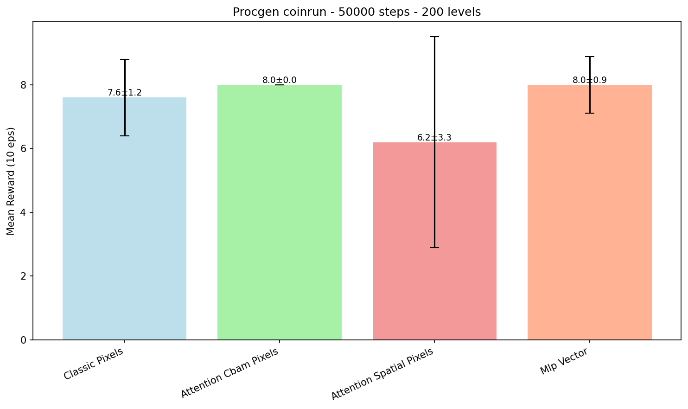

### 4.2. Bossfight 100k — World Models
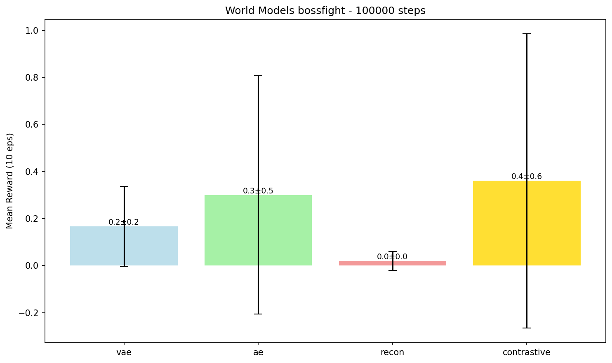

### 4.3. Suite 100k — 3 Jogos × 11 Arquiteturas
| Bossfight | Starpilot | Dodgeball |
|---|---|---|
| 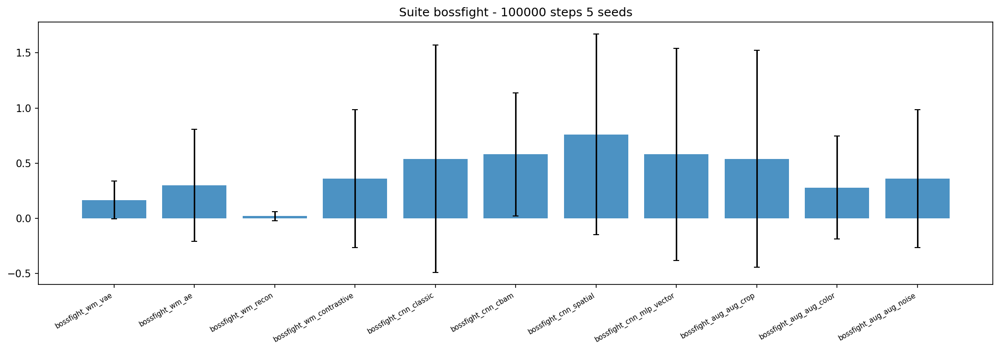 | 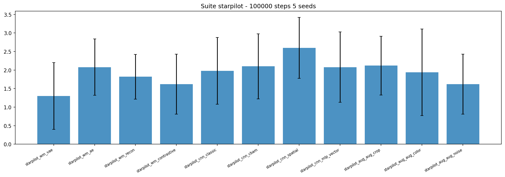 | 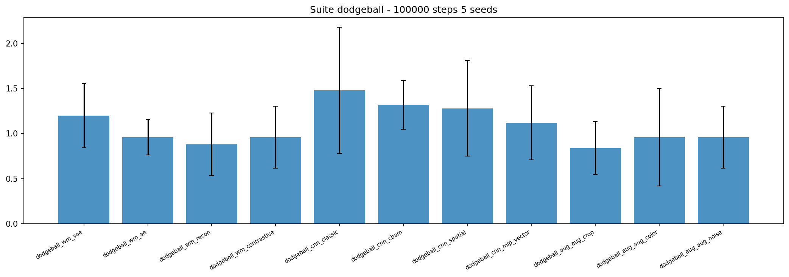 |

### 4.4. Bossfight HARD 100k — Stress Test
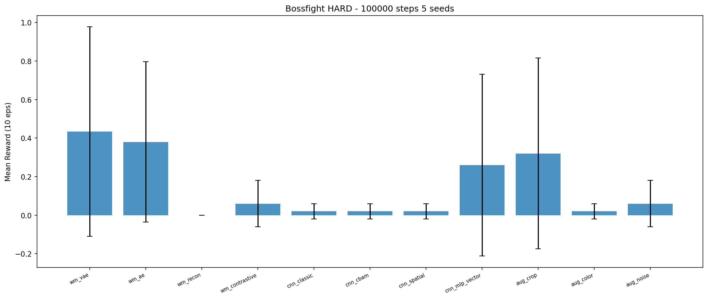

### 4.5. New Archs 100k — 5 Novas Arquiteturas ×3 Jogos
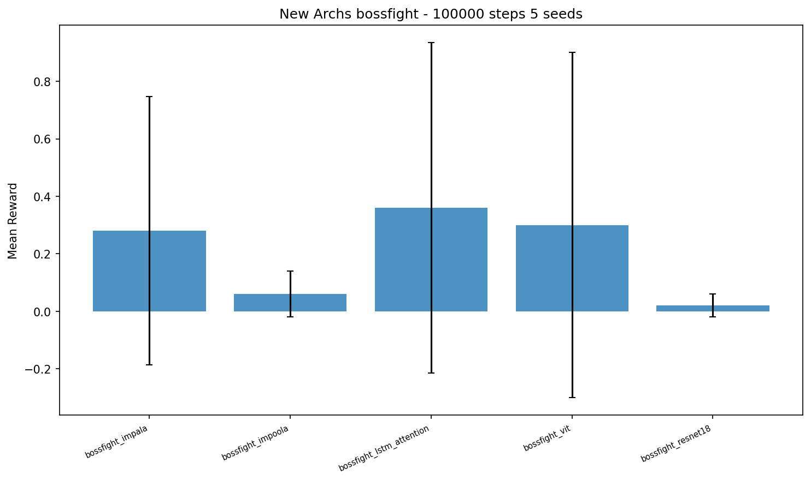 | 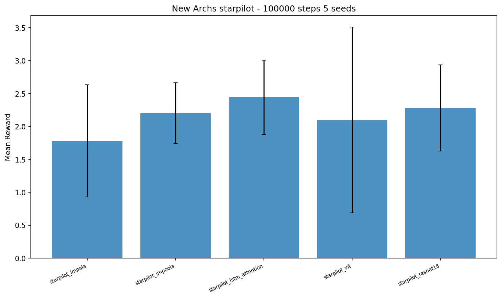 | 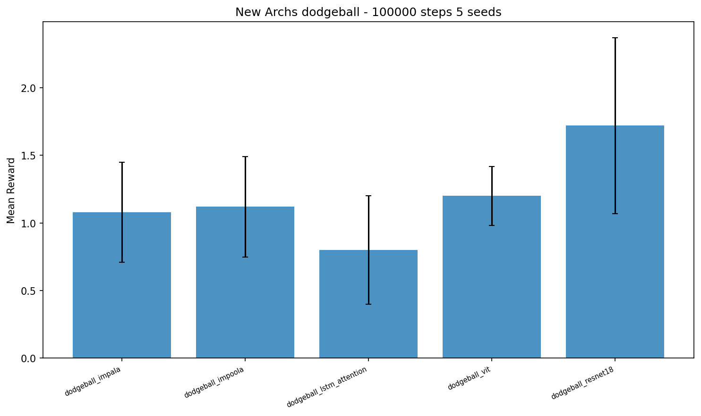

### 4.6. Maze+Heist 100k — PPO vs ICM/RND/NGU
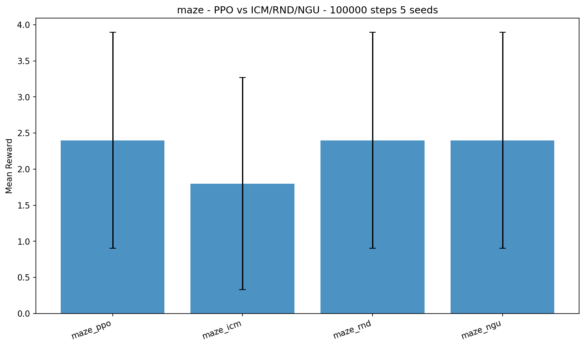 | 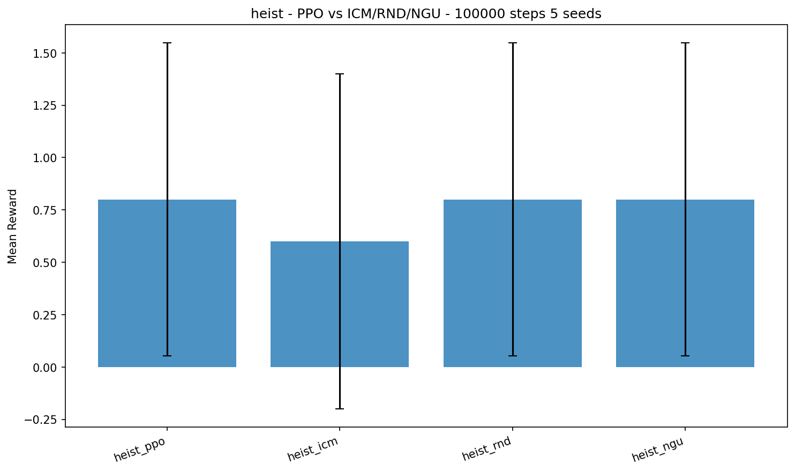

### 4.7. Global 16 — Média 3 Jogos
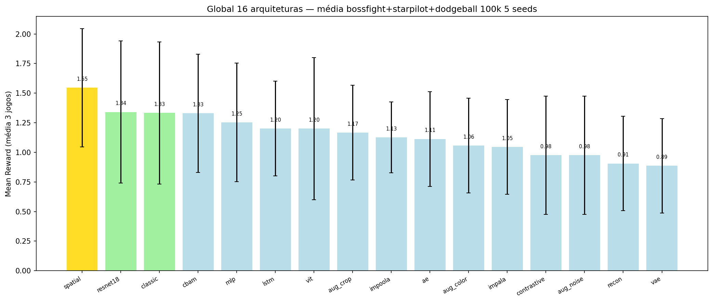

### 4.8. Vídeos

Vídeos lado-a-lado são gerados sob demanda (`visualize_side_by_side.py`) — bossfight com **sonhos** (`top=real`, `bottom=dream()` de `VAE/AE/Recon`; Contrastive exibe `no dream`) e coinrun com agentes lado-a-lado. Requer os `.zip` salvos pelos benchmarks durante o treino:
  ```powershell
  py -3.10 visualize_side_by_side.py --benchmark world_models --game bossfight --log_dir ./logs_world_models --mode mp4 --out results/bossfight_dreams.mp4 --steps 600 --device cuda
  py -3.10 visualize_side_by_side.py --benchmark procgen --game coinrun --log_dir ./logs_procgen --mode mp4 --out results/coinrun_side_by_side.mp4 --steps 600 --device cuda
  ```
- **Curvas de treino por seed:** `statistics.json` + `comparison_results.json` por benchmark + `tensorboard --logdir logs_suite` (logs tensorboard são descartáveis/gerados sob demanda).

---

## 5. Como Reproduzir

```powershell
# Ambiente (Python 3.10 obrigatório para Procgen) — versões pinadas em requirements.txt
pip install -r requirements.txt

# ou manualmente (mesmas versões validadas):
C:\Users\Acer\AppData\Local\Programs\Python\Python310\python.exe -m pip install procgen==0.10.7 stable-baselines3==2.9.0 gymnasium==1.3.0 gym==0.26.2 torch==2.5.1+cu121 opencv-python==4.8.0.74 --extra-index-url https://download.pytorch.org/whl/cu121

# Benchmarks 5 seeds
C:\Users\Acer\AppData\Local\Programs\Python\Python310\python.exe -u compare_world_models.py --timesteps 100000 --seeds 42 43 44 45 46 --num_levels 200 --log_dir ./logs_world_models --device cuda
C:\Users\Acer\AppData\Local\Programs\Python\Python310\python.exe -u compare_procgen.py --game coinrun --timesteps 50000 --seeds 42 43 44 45 46 --num_levels 200 --log_dir ./logs_procgen --device cuda
C:\Users\Acer\AppData\Local\Programs\Python\Python310\python.exe -u compare_suite.py --games bossfight starpilot dodgeball --timesteps 100000 --seeds 42 43 44 45 46 --log_dir ./logs_suite --device cuda
C:\Users\Acer\AppData\Local\Programs\Python\Python310\python.exe -u compare_bossfight_hard.py --timesteps 100000 --seeds 42 43 44 45 46 --log_dir ./logs_bossfight_hard --device cuda
C:\Users\Acer\AppData\Local\Programs\Python\Python310\python.exe -u compare_new_archs.py --timesteps 100000 --seeds 42 43 44 45 46 --games bossfight starpilot dodgeball --log_dir ./logs_new_archs --device cuda
C:\Users\Acer\AppData\Local\Programs\Python\Python310\python.exe -u compare_maze_heist.py --timesteps 100000 --seeds 42 43 44 45 46 --games maze heist --log_dir ./logs_maze_heist --device cuda
C:\Users\Acer\AppData\Local\Programs\Python\Python310\python.exe -u compare_combined.py  # agrega logs_suite + logs_new_archs no ranking global
py -3.10 -u re_eval_scorecard.py --device cuda  # re-eval 30 eps stoch+det dos 115 zips (sem retreino)
py -3.10 -u compare_suite_retrain.py --device cuda  # retreino da suite com protocolo novo (resume-safe)
py -3.10 scorecard_analysis.py  # IC 95% + Cohen's d + AUC -> results/scorecard.json
py -3.10 retrain_analysis.py  # análise do retreino + ranking global novo -> results/retrain_analysis.json
py -3.10 -u re_eval_100.py --device cuda  # protocolo definitivo: 100 eps em todos os 275 zips
py -3.10 eval100_analysis.py  # comparação 30 vs 100 -> results/eval100_analysis.json
py -3.10 probe_actions.py  # sondagem do espaço de ações (base das skills do HRL)
py -3.10 -u compare_hrl.py --device cuda  # benchmark independente HRL vs Flat (jumper/plunder)
py -3.10 -u compare_hrl_learned.py --device cuda  # braço hrl_learned (RODAR APÓS compare_hrl.py: ambos escrevem em results/hrl_results.json)
py -3.10 hrl_analysis.py  # análise dos 4 braços -> results/hrl_analysis.json
py -3.10 -u compare_budget_scaling.py --device cuda  # budget scaling 250k/500k (resume-safe)
py -3.10 budget_analysis.py  # curvas 100k->250k->500k -> results/budget_analysis.json
py -3.10 -u compare_algo_families.py --device cuda  # value vs policy-based (seção 12; requer sb3-contrib)
py -3.10 algo_analysis.py  # análise por família/algoritmo -> results/algo_families_analysis.json
py -3.10 -u lr_sensitivity.py --device cuda  # teste de sensibilidade de lr dos value-based (seção 12.2)
```

**Estimativas `cuda`:** `coinrun 50k` `5×50k` `~35 min`, `bossfight 100k` `5×100k` `~67 min`, `suite 100k` `3 jogos ×11×5×100k` `16.5M steps` `~15h` (`20:41→04:47`), `bossfight hard` `~2.5h`, `new archs 100k` `3 jogos ×5×5×100k` `7.5M steps` `~12h` (`13:45→01:39`), `maze+heist 100k` `2 jogos ×4×5×100k` `4M steps` `~6.5h` (`01:48→08:23`), `combined` imediato, `re-eval 115 zips` `~70 min`, `suite retrain 165 modelos` `~28h` (`bossfight ~10 min/modelo`, `dodgeball ~3 min/modelo`), `re-eval 100 eps 275 zips` `~5h`.

---

## 6. Próximos Benchmarks Propostos

> **Nota:** os caminhos `D:\mario-ds`, `D:\mujoco-walker`, `D:\Imitation-player` e `D:\mario64ds-rl` são **repositórios externos de referência** fora deste projeto — não são necessários para reproduzir os benchmarks acima.

| # | Origem | Benchmark em `Procgen` `RL` (não só `loss` como `Imitation-player:171`) | Tempo |
|---|---|---|---|
| 1 | `mujoco-walker:50` | **Offline RL** `100k` `bossfight` `expert` `BC` vs `IQL` vs `CQL` vs `Decision Transformer` | `~40 min` offline |

### 6.1. Roadmap de Instrumentação — 6 Melhorias Priorizadas

O próximo salto não é adicionar arquiteturas, e sim instrumentar melhor as que já foram testadas (ver análise crítica externa). Prioridade por `custo × valor`:

| # | Sugestão | Status | Detalhes |
|---:|---|---|---|
| 1 | **50–100 episódios de eval** | ✅ concluído (`re_eval_scorecard.py`: `115/115` modelos, `30 eps`) | `n_eval_episodes=10` era pouco — rankings mudaram (seção 3.10); modelos dos benchmarks antigos foram deletados, então só os `115` zips sobreviventes eram re-avaliáveis |
| 2 | **Eval duplo: `deterministic=True` + `False`** | ✅ concluído (mesmo script, colunas `stoch`/`det` na seção 3.10) | confirmar o aviso da seção 1.3: modo determinístico colapsa políticas estocásticas (`maze` `2.47→0.60`) — reportar ambos |
| 3 | **Intervalos de confiança + effect size** | ✅ concluído (`scorecard_analysis.py` → seção 3.8) | com `n=5 seeds`, diferenças pequenas não suportam conclusão de superioridade; `IC 95%` (`t` de Student) e `Cohen's d` por par em `results/scorecard.json` |
| 4 | **Scorecard: robustez + sample efficiency (AUC)** | ✅ AUC concluído (seção 3.9); robustez = std já existente | `AUC(reward, env_steps)` das curvas `tensorboard` de `new_archs`/`maze_heist`; pergunta muda de "quem ganhou" para "quem aprende mais rápido"; **não requereu retreino** |
| 5 | **Scorecard: generalization gap** | ✅ concluído (item 1, sem retreino) | `gap = train(200 níveis, seed treino) − unseen`; ≈ `0`/negativo na maioria → sem memorização (seção 3.10) |
| 6 | **Budget scaling `100k→250k→500k`** | ✅ concluído (`compare_budget_scaling.py` → seção 3.13) | `24 jobs` (`250k+500k` × `resnet18+mlp_vector` × `starpilot+dodgeball` × `3 seeds`); veredito: **curvas estagnam — mais budget não era necessário** |

**Scorecard final** (4 eixos preenchidos — `Performance` = re-eval `30 eps stoch`, `AUC` seção 3.9, `Generalização` = gen gap seção 3.10, `Robustez` = ±std entre seeds; ordenado por Performance):

| Modelo | 🧠 Performance | ⚡ AUC | 🌎 Gap | 🎲 Robustez |
|---|---:|---:|---:|---:|
| `bossfight_resnet18` | **0.39** | 0.107 | −0.12 | ±0.50 |
| `bossfight_impala` | 0.33 | 0.141 | −0.10 | ±0.27 |
| `bossfight_lstm_attention` | 0.32 | **0.247** | −0.20 | ±0.47 |
| `bossfight_vit` | 0.29 | 0.064 | −0.27 | ±0.57 |
| `bossfight_impoola` | 0.25 | 0.186 | −0.21 | ±0.47 |
| `starpilot_lstm_attention` | **2.63** | 2.284 | +0.15 | **±0.44** |
| `starpilot_resnet18` | 2.53 | 2.325 | −0.51 | ±0.36 |
| `starpilot_impoola` | 2.44 | 2.230 | −0.19 | ±0.68 |
| `starpilot_impala` | 2.00 | **2.336** | +0.31 | ±0.45 |
| `starpilot_vit` | 1.88 | 2.297 | −0.07 | ±0.68 |
| `dodgeball_resnet18` | **1.07** | **1.175** | +0.27 | ±0.40 |
| `dodgeball_impoola` | 1.05 | 1.151 | −0.07 | ±0.31 |
| `dodgeball_impala` | 1.04 | 1.169 | −0.11 | **±0.20** |
| `dodgeball_lstm_attention` | 0.99 | 1.114 | +0.24 | ±0.23 |
| `dodgeball_vit` | 0.91 | 1.032 | −0.21 | ±0.35 |
| `maze_icm` | **2.80** | 3.658 | +0.80 | ±0.98 |
| `maze_ppo`=`rnd`=`ngu` | 2.47 | **3.785** | +0.73 | ±1.17 |
| `heist_icm` | **0.73** | 1.792 | −0.47 | ±0.71 |
| `heist_ppo`=`rnd`=`ngu` | 0.67 | **1.826** | 0.00 | ±0.73 |

**Scorecard — suite retrain** (seção 3.11; Performance = média dos 3 jogos; `AUC` indisponível — logs TB antigos deletados; `aug_noise` ≡ `wm_contrastive`, ver nota):

| Modelo | 🧠 Performance | ⚡ AUC | 🌎 Gap | 🎲 Robustez |
|---|---:|---:|---:|---:|
| `cnn_mlp_vector` | **1.36** | — | −0.01 | ±0.41 |
| `cnn_spatial` | 1.35 | — | −0.02 | ±0.38 |
| `aug_crop` | 1.31 | — | −0.17 | ±0.44 |
| `cnn_cbam` | 1.24 | — | −0.26 | ±0.54 |
| `cnn_classic` | 1.16 | — | −0.16 | ±0.46 |
| `wm_ae` | 1.13 | — | −0.02 | **±0.23** |
| `wm_recon` | 1.05 | — | −0.25 | ±0.33 |
| `wm_contrastive`=`aug_noise` | 1.04 | — | −0.14 | ±0.52 |
| `aug_color` | 1.02 | — | −0.06 | ±0.48 |
| `wm_vae` | 0.92 | — | +0.11 | ±0.32 (n=2–3) |
> Nota: `ContrastiveNoise` herda `ContrastiveExtractor` sem alterar o `forward` (`compare_augment_contrastive.py:42`) — com mesmos seeds, é um duplicado exato do `wm_contrastive` (resultados idênticos nos 3 jogos). Ler como `9` configs independentes, não `11`.
> Leitura cruzada (dados unificados, `275` modelos no protocolo novo): **global top-4: `mlp_vector 1.36` > `spatial 1.35` > `lstm_attention 1.34` > `aug_crop 1.31`** — todos estatisticamente indistinguíveis (seção 3.8). `starpilot_lstm_attention` segue único líder dos 4 eixos num jogo só; agora empatado em Performance com `cnn_spatial` (`2.63`). `resnet18` perde o topo de `dodgeball` para `cnn_mlp_vector` (`1.21` vs `1.07`). `ICM` lidera `maze`/`heist` mas perde AUC. Gap ≈ `0`/negativo na maioria — sem memorização (exceção: `maze` `+0.7~+0.8`).
> 📌 **Nota:** os valores acima são do protocolo de `30 eps`; o protocolo definitivo de `100 eps` (seção 3.12) consolida `mlp_vector` no topo (`1.43`), devolve `resnet18` ao topo de `dodgeball` e empata `ICM` com `PPO` em `maze`/`heist`.

---

## 7. Resultados por Seed (Completo) — 5 Seeds `42-46`, 10 Eps `deterministic=False`

**Coinrun 50k 5 seeds** `logs_procgen/comparison_coinrun_20260827_204023/comparison_results.json:1`
| Config | 42 | 43 | 44 | 45 | 46 | Mean±Std |
|---|---:|---:|---:|---:|---:|---|
| `classic` | 7.0 | 6.0 | 7.0 | 9.0 | 9.0 | **7.6±1.2** |
| `cbam` | 8.0 | 8.0 | 8.0 | 8.0 | 8.0 | **8.0±0.0** |
| `spatial` | 6.0 | 0.0 | 7.0 | 9.0 | 9.0 | **6.2±3.31** |
| `mlp_vector` | 7.0 | 7.0 | 8.0 | 9.0 | 9.0 | **8.0±0.89** |

**Bossfight 100k 5 seeds (World Models)** `logs_world_models/comparison_bossfight_20260827_193327/comparison_results.json:1`
| Config | 42 | 43 | 44 | 45 | 46 | Mean±Std |
|---|---:|---:|---:|---:|---:|---|
| `vae` | 0.0 | 0.0 | 0.1 | 0.4 | 0.4 | 0.16±0.16 |
| `ae` | 0.0 | 0.0 | 0.1 | 0.1 | 1.3 | 0.30±0.50 |
| `recon` | 0.0 | 0.0 | 0.0 | 0.0 | 0.1 | 0.02±0.04 |
| `contrastive` | 0.0 | 0.0 | 0.0 | 0.2 | 1.6 | **0.36±0.62** |

**Bossfight HARD 100k 5 seeds** `logs_bossfight_hard/comparison_bossfight_hard_20260828_072148/comparison_results.json:1`
| Config | 42 | 43 | 44 | 45 | 46 | Mean±Std |
|---|---:|---:|---:|---:|---:|---|
| `vae` | 0.0 | 0.0 | 0.4 | 1.2 | 0.6 | **0.43±0.54** |
| `ae` | 0.1 | 0.1 | 0.4 | 0.1 | 1.2 | 0.38±0.41 |
| `recon` | 0.0 | 0.0 | 0.0 | 0.0 | 0.0 | 0.0±0.0 |
| `contrastive` | 0.0 | 0.0 | 0.0 | 0.0 | 0.3 | 0.06±0.12 |
| `classic` | 0.0 | 0.0 | 0.0 | 0.0 | 0.1 | 0.02±0.04 |
| `cbam` | 0.0 | 0.0 | 0.0 | 0.0 | 0.1 | 0.02±0.04 |
| `spatial` | 0.0 | 0.0 | 0.0 | 0.0 | 0.1 | 0.02±0.04 |
| `mlp` | 0.0 | 0.0 | 0.0 | 0.1 | 1.2 | 0.26±0.47 |
| `aug_crop` | 0.0 | 0.0 | 0.0 | 0.3 | 1.3 | 0.32±0.49 |
| `aug_color` | 0.0 | 0.0 | 0.0 | 0.0 | 0.1 | 0.02±0.04 |
| `aug_noise` | 0.0 | 0.0 | 0.0 | 0.0 | 0.3 | 0.06±0.12 |

**Suite 100k 3 Jogos (11 configs×3×5=165 entradas)** `logs_suite/suite_bossfight_starpilot_dodgeball_20260827_204109/suite_results.json:1` — `mean` em `suite_statistics.json:1`; ex `starpilot spatial: [1.6,2.1,2.2,3.2,3.5] 2.6±0.82`, `dodgeball classic: [0.8,1.0,1.4,1.5,2.7] 1.48±0.69`. Full `165` linhas preservadas em `suite_results.json` para `LaTeX`.

**New Archs 100k 3 Jogos (5×3×5=75 entradas)** `logs_new_archs/new_archs_bossfight_starpilot_dodgeball_20260828_134545/comparison_results.json:1`
| Config | 42 | 43 | 44 | 45 | 46 | Mean±Std |
|---|---:|---:|---:|---:|---:|---|
| `bossfight_impala` | 0.0 | 0.2 | 0.0 | 0.0 | 1.2 | 0.28±0.47 |
| `starpilot_lstm_attention` | 2.3 | 2.9 | 1.4 | 2.7 | 2.9 | **2.44±0.56** |
| `dodgeball_resnet18` | 1.2 | 1.6 | 1.4 | 3.0 | 1.4 | **1.72±0.65** |

**Maze+Heist 100k 2 Jogos (4×2×5=40 entradas)** `logs_maze_heist/maze_heist_maze_heist_20260829_014802/comparison_results.json:1`
| Config | 42 | 43 | 44 | 45 | 46 | Mean±Std |
|---|---:|---:|---:|---:|---:|---|
| `maze_ppo` | 2.0 | 3.0 | 1.0 | 1.0 | 5.0 | **2.4±1.50** |
| `maze_icm` | 0.0 | 1.0 | 1.0 | 3.0 | 4.0 | 1.8±1.46 |
| `heist_ppo` | 0.0 | 0.0 | 1.0 | 1.0 | 2.0 | **0.8±0.74** |
| `heist_icm` | 1.0 | 0.0 | 0.0 | 0.0 | 2.0 | 0.6±0.80 |

## 8. Vídeos

Gerados sob demanda via `visualize_side_by_side.py` (comandos na seção 4.8): `bossfight_dreams.mp4` (World Models com sonhos) e `coinrun_side_by_side.mp4` (CNN vs MLP lado-a-lado). Saída `mp4` com painéis `128×128` por agente `hstack` `15 FPS`; `dream` para `VAE/AE/Recon` (`models/world_model_extractors.py:6` `dream()` `deconv`), `Contrastive` exibe `no dream`. Requer os `.zip` salvos durante o treino dos benchmarks.

## 9. Hardware e Limitações

- **Hardware:** `NVIDIA GeForce RTX 4070 Laptop` `556.29` `CUDA 12.5` `WDDM` `8 GB VRAM` `58°C` `~30%` `GPU-Util` durante `PPO` `cuda` (`nvidia-smi` `20:41`), `Python 3.10.11` `torch 2.5.1+cu121` `gym 0.26.2` `gymnasium 1.3.0` `stable-baselines3 2.9.0`.
- **Limitações:** `bossfight 100k` `easy` já `<1.0` (`0.76±0.90`) e `hard` `0.02±0.04` zeram `CNN` — `suite 100k` `16.5M steps` é `mínimo` para `ranking`; `ViT` medido no `benchmark #6`: `~4.6 min/run` em `bossfight` mas `16-25 min/run` em `starpilot` (`~4×` mais lento que `CNN`, variável por jogo) — a estimativa antiga de `~15×` (`Imitation-player:171`) era de `loss` imitation, não de `PPO`; ainda assim `ViT 1.20` global não supera `lstm/spatial`; `Imitation BC` só viu `loss` (`ResNet 2.90` melhor) sem `reward` `RL` — `#4` corrige isso.

## 10. Referências

- `Procgen` (`Cobbe et al.`), `DreamerV3` (`SheepRL`), `CURL`/`SPR` (`mario-ds:121`), `CBAM` (`Woo et al.`), `PPO` (`Schulman`), `Stable-Baselines3`, `Imitation-player` `compare_models.py` `Nature 3.48` vs `ResNet 2.90`.

---

## 11. Benchmark Independente — HRL vs Flat RL (`jumper`/`plunder`)

> ⚠️ **Separado do estudo principal:** não entra no scorecard das seções 3.x/6.1; logs/resultados próprios (`logs_hrl/`, `results/hrl_results.json`).

**Pergunta:** hierarquia ajuda em `100k` frames? Quatro braços com **mesmo budget de `100k` frames primitivos**, `PPO` idêntico (`lr 3e-4`, `NatureCNN`, mesmos hiperparâmetros do estudo):

| Braço | Descrição | Decisões treinadas |
|---|---|---:|
| `flat` | PPO sobre as `15` ações primitivas | `100k` |
| `skip4` | action-repeat `4` (controle: abstração temporal **sem** hierarquia) | `25k` |
| `hrl` | PPO meta-controlador sobre `6` skills **fixas** × `4` frames (framework de opções, `compare_hrl.py:34`) | `25k` |
| `hrl_learned` | hierarquia 2 níveis treinada em conjunto (`compare_hrl_learned.py`): meta escolhe `6` skills **latentes aprendidas** a cada `4` frames; low-level `π(a\|obs,z)` executa ações primitivas; especialização emergente (sem incentivo de diversidade) | `25k` meta + `100k` low |

**Skills do braço `hrl`** (sondagem empírica `probe_actions.py` + mapeamento oficial de ações do `procgen/env.py`; `UP`=pulo em `jumper`, `D`=tiro em `plunder`): `wait`, `left`, `right`, `jump|shoot`, `jump_left|shoot_left`, `jump_right|shoot_right`.

**Notas de comparabilidade:** `hrl_learned` recebe atualização por frame no low-level (sinal de gradiente comparável ao `flat`) e usa truncamento com bootstrap em `HORIZON=256` frames (episódios de `jumper` passam de `500`; sem o teto o meta quase não decidiria) — os demais braços usam episódios nativos. Modelo salvo como `.pt` (meta+low) em `logs_hrl/hrl_zips/`, não `.zip` SB3.

**Protocolo:** `2 jogos × 4 braços × 5 seeds` = `40 runs` (`30` do `compare_hrl.py` + `10` do `compare_hrl_learned.py`, sequencial); treino `num_levels=200` `easy`; eval definitivo `100 eps` stoch + `100 det` (unseen `seed+1000`) + `15 eps` train. Dados em `results/hrl_results.json`, análise em `results/hrl_analysis.json` (`hrl_analysis.py`).

### 11.1. Resultados (concluído: `40/40`, `0 erros`)

| Braço | `jumper` stoch | `jumper` det | `plunder` stoch | `plunder` det |
|---|---:|---:|---:|---:|
| `flat` | 0.90±0.49 | 0.38 | 3.53±0.45 | 0.61 |
| `skip4` | **3.76±0.48** | 0.38 | 3.36±0.28 | 1.32 |
| `hrl` (fixo) | 3.72±0.86 | 0.66 | 3.24±0.14 | 0.85 |
| `hrl_learned` | 2.96±0.45 | 0.44 | **4.16±0.33** | **2.70** |

> **4 achados:** (1) **`jumper`: o ganho é de abstração temporal, não de hierarquia** — `skip4`≈`hrl` (`3.7`) dão `4×` o `flat` (`0.90`); segurar direção/pulo por `4` frames é o que destrava o jogo, e a biblioteca de skills não adicionou nada além do action-repeat. (2) **`hrl_learned` fica entre o `flat` e os braços com abstração em `jumper`** (`2.96`) — co-treinar meta+low precisa de mais budget para alcançar skills pré-projetadas. (3) **`plunder`: `hrl_learned` é o único braço que ganha** (`4.16` vs `3.53` do `flat`, menor std `0.33`) — a macro fixa de segurar o tiro `4` frames não serve ao timing de tiro, mas a skill aprendida se adapta; os braços fixos empatam com o `flat`. (4) **modo determinístico:** colapsa todos os braços em `jumper` (`0.38–0.66`, política estocástica é essencial), mas em `plunder` o `hrl_learned` destoa (`det 2.70` vs `≤1.32`) — a hierarquia aprendida produz política mais explorável deterministicamente. Gen gap `plunder hrl_learned` `+0.97` (único relevante).

---

## 12. Benchmark Independente — Value-based vs Policy-based (`starpilot`/`dodgeball`/`bossfight`)

> ⚠️ **Separado do estudo principal** (que comparou *arquiteturas* com `PPO` fixo): aqui a variável é a **família do algoritmo**. Logs/resultados próprios (`logs_algo/`, `results/algo_families_results.json`).

**Pergunta:** em `100k` steps com imagens, gradient de política (on-policy) supera bootstrapping de valor (off-policy)?

| Família | Algoritmos | Característica |
|---|---|---|
| **Policy-based** | `PPO` (hiperparâmetros do estudo), `A2C` (default SB3, `lr 3e-4`) | on-policy, `100k` decisões efetivas de update |
| **Value-based** | `DQN`, `QR-DQN` (`sb3-contrib`, distribucional `200 quantiles`) | off-policy, replay buffer |

**Fairness:** arquitetura idêntica para todos (`CnnPolicy`/`NatureCNN` `512D`); `3 jogos × 4 algos × 5 seeds = 60 runs`; eval definitivo (`100 eps` stoch + `100 det` unseen `seed+1000` + `15 train`).

**Adaptações documentadas dos value-based para budget pequeno** (`compare_algo_families.py:32`): `buffer_size=100k` (default `1M` não cabe em RAM com imagens), `learning_starts=5000` e `exploration_fraction=0.25` (defaults Atari de `50k`/`10%` consomem metade/ignoram o budget), `lr=1e-4` (default do DQN; `3e-4` desestabiliza o TD-error), `train_freq=4`, `gradient_steps=1`, `target_update_interval=500`, `batch=64`.

> ⚠️ **Limitação de fairness (critério adotado):** a comparação usa *best practice por algoritmo* (`lr 3e-4` policy vs `lr 1e-4` value), não *configuração idêntica*. O critério idêntico (`3e-4` para todos) arriscaria medir "DQN com lr errado diverge" em vez de "família value é pior". Como não houve sweep de lr, a conclusão é condicionada aos defaults — o **teste de sensibilidade** `lr_sensitivity.py` (seção 12.2: `dqn`/`qrdqn` a `3e-4` em `starpilot`, o jogo do maior gap, `10 runs`) verifica se a diferença de lr explica o resultado. **Resultado do teste (seção 12.2): não explica** — `dqn 0.65→0.66`, `qrdqn 1.04→1.25` (dentro do ruído).

**Status:** concluído (`60/60`, `0 erros`, `~9h` `01/09 20:09→02/09 05:12`). Dados em `results/algo_families_results.json`, análise em `results/algo_families_analysis.json` (`algo_analysis.py`).

### 12.1. Resultados (stoch unseen `100 eps`, média±std de `5 seeds`)

| Jogo | `ppo` | `a2c` | `dqn` | `qrdqn` |
|---|---:|---:|---:|---:|
| `starpilot` | 2.29±0.47 | **2.38±0.29** | 0.65±0.37 | 1.04±0.26 |
| `dodgeball` | 0.65±0.36 | **0.89±0.10** | 0.18±0.09 | 0.61±0.49 |
| `bossfight` | 0.18±0.29 | 0.05±0.06 | 0.03±0.05 | **0.28±0.50** |
| **Família (média 3 jogos)** | `policy` **1.07** | | `value` 0.47 | |

> **4 achados:** (1) **Policy-based vence a família** (`1.07` vs `0.47`, `2.3×`) — em `100k` steps com imagens, on-policy supera bootstrapping de valor, confirmando a hipótese do regime low-data (seção 1.4). (2) **QR-DQN encurta muito a distância** (`+60%` sobre `DQN` em `starpilot`: `1.04` vs `0.65`) e em `bossfight` (sparse/ruído alto) **é o único algoritmo que lidera** (`0.28` vs `ppo 0.18`) — RL distribucional se beneficia exatamente onde a incerteza é alta. (3) **`A2C` ≈ ou > `PPO` em `starpilot`/`dodgeball`** (`2.38/0.89` vs `2.29/0.65`), mas **colapsa em `bossfight`** (`0.05` vs `0.18`) — sem clipping, um outlier de gradiente no jogo sparse destrói a política; o clipping do `PPO` vale seu custo onde a estabilidade importa. (4) **Gen gap `≈0` em todos** os `12` braços — nenhuma família memoriza níveis de treino (consistente com as seções 3.10/3.13). Nota de contexto: os valores diferem dos da seção 3.12 porque aqui o extrator é `NatureCNN` padrão para todos (o estudo principal usou extratores custom) — comparação válida *dentro* desta tabela.

### 12.2. Teste de Sensibilidade de `lr` — a conclusão depende do `1e-4`? (`lr_sensitivity.py`, concluído `10/10`)

`dqn`/`qrdqn` re-treinados a `3e-4` (o lr do PPO/A2C) em `starpilot` (jogo do maior gap), `5 seeds`, protocolo idêntico. Dados em `results/lr_sensitivity_results.json`:

| Algoritmo | `lr 1e-4` (seção 12.1) | `lr 3e-4` | Δ | Referência policy |
|---|---:|---:|---:|---:|
| `dqn` | 0.65±0.37 | 0.66±0.44 | **+0.01 (empate)** | `ppo 2.29` / `a2c 2.38` |
| `qrdqn` | 1.04±0.26 | 1.25±0.37 | +0.21 (dentro do ruído) | idem |
> **Veredito:** triplicar o lr dos value-based **não muda a conclusão**. `DQN` fica idêntico (`0.65→0.66`); `QR-DQN` sobe `+0.21`, abaixo do ruído entre seeds (`SE` da diferença `≈0.20` com `n=5`) — tendência leve, não significativa. Ambos seguem `~2×` abaixo do PPO/A2C (`2.29/2.38`). A limitação de fairness da seção 12 fica assim **resolvida empiricamente**: o gap policy-vs-value em `100k` não é artefato da escolha de lr (pelo menos em `starpilot`, o jogo testado).
